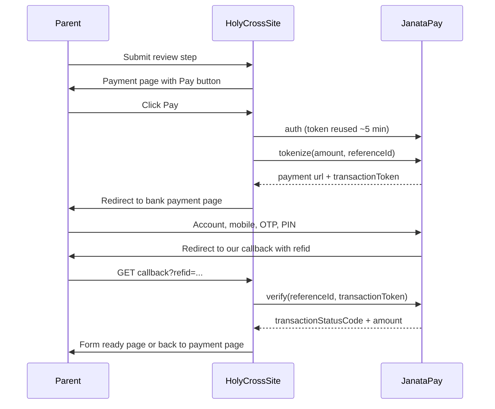

# Online Payment — JanataPay (Janata Bank) Gateway

This document explains how admission fees are collected online through the JanataPay payment gateway, how to set it up, how to test it with the sandbox accounts, and how to operate it day to day.

- Gateway: JanataPay by Janata Bank PLC (guide version 1.0.1)
- Environment in use: **Sandbox** (`https://sandbox-pg.janatapay.com`)
- Bank technical support: Hafijur Rahaman — hafij@janatabank-bd.com — 01671761155

---

## 1. How a payment works (big picture)

1. The parent fills in the admission form and clicks **Submit** on the final Review step.
2. The site assigns an application number (for example `1-26-00012`) and shows the **Admission payment** page with the amount due.
3. The parent clicks **Pay BDT … with JanataPay**. The server talks to the bank (never the browser), creates a payment session, and redirects the parent to the bank's secure payment page.
4. On the bank page the parent enters the Janata Bank account number, account name, mobile number, then the OTP and eJanata PIN.
5. The bank sends the parent back to our site with `?refid=<our reference>`.
6. Our server **asks the bank directly** (the Verify API) what really happened. The redirect alone is never trusted.
7. Only if the bank says **Success (1003)** *and* the amount matches the fee, the application is marked **Paid**, the PDF form is generated, and the confirmation email is sent. The parent lands on the "form ready" page and can download the form.
8. If the parent closed the browser, lost internet, or the bank was slow, a background job (**reconciliation**) re-checks unfinished payments every few minutes and completes them automatically.



### Application and payment states

| What happened | Application status | Payment attempt status |
|---|---|---|
| Form submitted, not paid yet | Awaiting payment | — |
| Parent sent to bank | Awaiting payment | Started (1001/1002) |
| Bank confirmed + amount matched | **Paid** | Success (1003) |
| Payment failed at bank | Payment failed (can retry) | Failed (1004) |
| Parent pressed Cancel at bank | Payment failed (can retry) | Cancelled (1005) |
| Bank refunded the payment | unchanged, admin note added | Refunded (1007) |
| No final answer for 48 hours | unchanged | Expired |

A parent can retry as many times as needed; each try is a new **Payment attempt** with its own unique reference.

---

## 2. Setup

### 2.1 Install dependencies

```bash
source venv/bin/activate
pip install -r requirements.txt     # adds requests, cryptography, python-dotenv
python manage.py migrate            # adds payment fields + gateway token table (migration 0016)
```

### 2.2 Credentials (`.env`)

Credentials live in a `.env` file in the project root (next to `manage.py`). It is git-ignored — **never commit it**. A template is in `.env.example`.

```ini
PAYMENT_GATEWAY=janatapay            # "janatapay" = real gateway, "stub" = local simulate buttons

JANATAPAY_BASE_URL=https://sandbox-pg.janatapay.com
JANATAPAY_USERNAME=<merchant username>
JANATAPAY_PASSWORD=<merchant password>
JANATAPAY_MERCHANT_UID=<merchant UID>
JANATAPAY_PUBLIC_KEY=<raw Base64 public key, exactly as given by the bank, one line>

JANATAPAY_TIMEOUT=30                 # seconds per API call
JANATAPAY_PAYMENT_WINDOW_MINUTES=20  # viva seat is held this long once the parent goes to the bank
JANATAPAY_CURRENCY=BDT
```

The sandbox credentials supplied by the bank are already filled in the local `.env`.

### 2.3 Check the connection

```bash
python manage.py janatapay_check                 # logs in to the gateway
python manage.py janatapay_check --tokenize 10   # also creates a 10 BDT test payment and prints its URL
```

Expected output:

```
Gateway: https://sandbox-pg.janatapay.com  (PAYMENT_GATEWAY=janatapay)
Authentication OK. Token expires at 2026-09-28 14:48:18 UTC.
Tokenize OK.
  Reference ID : HCTEST26E28C8E7E
  Payment URL  : https://sandbox-pg.janatapay.com/jbagg/init-payment?token=...
  Verify status: 1001 Initiated (amount 10)
```

### 2.4 Register the callback URL with the bank (required)

After payment the bank redirects the parent to a URL that is **registered on the bank's side** — we cannot set it per request. Ask Janata Bank to set the merchant's success, fail and cancel URLs to:

| Purpose | URL |
|---|---|
| Success / Fail / Cancel (one URL is enough) | `https://holycrossrajshahi.edu.bd/admission/payment/janatapay/callback/` |
| Optional separate success URL | `https://holycrossrajshahi.edu.bd/admission/payment/janatapay/success/` |
| Optional separate fail URL | `https://holycrossrajshahi.edu.bd/admission/payment/janatapay/fail/` |
| Optional separate cancel URL | `https://holycrossrajshahi.edu.bd/admission/payment/janatapay/cancel/` |

All four behave the same way: they read `refid`, verify with the bank, and show the correct result.

> **Current status (checked 28 Sep 2026):** the sandbox merchant account is still redirecting to
> `https://sandbox.eduapi.xyz/api/v1/site/student/payment/gateway-callback-url?refid=...`, which is **not our site**.
> Until the bank changes it, see "Testing locally" below for a workaround.

For local testing you can also ask the bank to register `http://127.0.0.1:8000/admission/payment/janatapay/callback/`, or expose your machine with a tunnel (for example `ngrok http 8000`) and register the tunnel URL.

### 2.5 Schedule reconciliation (required in production)

The bank requires merchants to re-check unfinished payments. Add these to the server's crontab (adjust paths):

```cron
*/5  * * * * cd /path/to/site && venv/bin/python manage.py reconcile_payments >> logs/payments.log 2>&1
*/10 * * * * cd /path/to/site && venv/bin/python manage.py expire_admission_holds >> logs/holds.log 2>&1
```

`reconcile_payments` verifies every attempt that is still "Started", at least 5 minutes old and at most 48 hours old. Anything older than 48 hours with no answer is marked "Expired". Options: `--min-age MINUTES`, `--max-age HOURS`.

---

## 3. Testing in the sandbox

Test accounts supplied by the bank (sandbox only — no real money):

| Scenario | Account no | Mobile | OTP | eJanata PIN |
|---|---|---|---|---|
| Success | `0100012345678` | `01671761155` | `123456` | `123456` |
| Failure | `0100123456789` | `01671771155` | `123456` | `123456` |

"Account Name" can be any text.

### 3.1 Full test through the website

1. Make sure `.env` has `PAYMENT_GATEWAY=janatapay` and run `python manage.py runserver`.
2. In Admin → Admission Sessions, open a session with a **whole-number** fee (e.g. 500) and make it open.
3. Go to `http://127.0.0.1:8000/admission/apply/`, fill in all steps and submit the Review step.
4. On the payment page click **Pay BDT 500 with JanataPay**.
5. On the bank page click the **Janata Bank** tile, enter the **Success** account above, then OTP and PIN.
6. The bank redirects back with `?refid=...`:
   - If the callback URL is registered to our site you land on the "form ready" page automatically.
   - If it still points elsewhere (see 2.4), open `http://127.0.0.1:8000/admission/payment/janatapay/callback/?refid=<refid from the address bar>` — or simply reopen the payment page for that application; it re-checks the bank automatically and moves on to the form page once confirmed.
7. Repeat with the **Failure** account: you return to the payment page with "Payment failed … You can try again."

Note: the bank page shows an extra bank fee (for example "Payable BDT 15, Fee BDT 5" on a 10 BDT order). That fee is charged by the bank to the payer; the Verify API reports the **order amount** (10), which is what our amount check compares against.

### 3.2 Automated tests

```bash
python manage.py test admissions
```

Covers AES encryption round-trip, key handling, every status code (1002/1003/1004/1005), amount mismatch, idempotency (no double email), callback verification and reconciliation. Tests use a fake client and never call the bank.

### 3.3 Local development without the bank

Set `PAYMENT_GATEWAY=stub` in `.env`. With `DEBUG = True` the payment page then shows **Simulate success / Simulate fail** buttons instead of the JanataPay button.

---

## 4. Admin operations

Everything is in Django admin under **Admissions**.

- **Payment attempts** (`/admin/admissions/paymentattempt/`): every try with reference ID, bank status code and text, verified amount, FT number and timestamps. Select rows → action **Re-verify with gateway** to ask the bank again right now.
- **Applications**: the Payment attempts table is shown inside each application. Bulk action **Re-verify JanataPay payments with the bank** re-checks all pending attempts of the selected applications.
- **Mark paid (office)**: still available for cash payments at the school office.
- **Admin notes** on the application are filled automatically when something needs a human:
  - bank said success but the amount did not match (not marked paid),
  - payment was refunded by the bank,
  - payment arrived after the viva slot hold expired (paid, but a viva slot must be assigned manually).

### Answering a parent: "Money was deducted but the form shows unpaid"

1. Ask for the application number (or search by father's mobile).
2. Open the application → look at the Payment attempts table.
3. Select the application → action **Re-verify JanataPay payments with the bank**.
4. If the bank now says 1003 the form becomes Paid and the email is sent automatically. If it stays 1001/1002 the bank has not finished; try again later or contact bank support with the **reference ID**.

---

## 5. Technical reference

### 5.1 Code map

| File | What it does |
|---|---|
| `admissions/janatapay.py` | Low-level API client: AES-256-GCM, RSA-OAEP, auth / tokenize / verify, token caching |
| `admissions/payments.py` | `JanataPayGateway` (start payment, verify & apply result), `reconcile_pending_payments`, `get_gateway()` |
| `admissions/views.py` | `start_payment`, `janatapay_callback/success/fail/cancel`, payment page auto re-check |
| `admissions/models.py` | `PaymentAttempt` (reference, token, bank status…), `GatewayAuthToken` (cached token) |
| `admissions/management/commands/reconcile_payments.py` | Scheduled re-verification |
| `admissions/management/commands/janatapay_check.py` | Connectivity check |
| `templates/admissions/payment.html` | Payment page with the Pay button |

### 5.2 URLs

| URL | Method | Purpose |
|---|---|---|
| `/admission/payment/<token>/` | GET | Payment page (also re-checks a pending attempt) |
| `/admission/payment/<token>/start/` | POST | Tokenize and redirect to the bank |
| `/admission/payment/janatapay/callback/?refid=` | GET/POST | Bank return URL (verify) |
| `/admission/payment/janatapay/success/?refid=` | GET/POST | Same, for a separate success URL |
| `/admission/payment/janatapay/fail/?refid=` | GET/POST | Same, for a separate fail URL |
| `/admission/payment/janatapay/cancel/?refid=` | GET/POST | Same, for a separate cancel URL |

### 5.3 Wire format (confirmed against the sandbox)

The bank's PDF leaves some details open; these are the formats that actually work:

- **AES**: AES-256-GCM, random 12-byte IV. Ciphertext = `base64(IV + encrypted + 16-byte tag)`. Used for every request `data` and every response `data`.
- **AES key in auth**: the 32 random bytes are Base64-encoded; that Base64 **string** goes in the payload as `aesKey` **and** is what gets RSA-encrypted for `key`.
- **RSA**: OAEP with SHA-256 and MGF1-SHA-256. The bank's raw public key string is wrapped in `-----BEGIN PUBLIC KEY-----` lines (not decoded first).
- **Auth request**: `{"merchant": b64(merchantUid), "key": RSA(aesKeyB64), "data": AES({merchantUid, merchantUsername, merchantPassword, aesKey})}`
- **Auth response** (decrypted): `{"accessToken": "<JWT>", "refreshToken": "", "expiry": ""}`. The token is valid for **5 minutes**; expiry is read from the JWT `exp`.
- **Tokenize / Verify request**: `{"merchant": b64(merchantUid), "accessToken": "<JWT>", "data": AES(payload)}` — the top-level `accessToken` is **required** (otherwise the bank answers "CharSequence cannot be null or empty").
- **Tokenize payload**: `{merchantUid, amount (integer), currency "BDT", description, referenceId, accessToken}`. Response: `{"transactionToken", "expires", "url"}` (the guide calls it `paymentUrl`; the sandbox returns `url`). The bank payment page stays open for 10 minutes.
- **Verify payload**: `{merchantUid, referenceId, transactionToken, accessToken}`. Response: `{"statusCode":200, "statusMessage":"DATA FOUND!", "data":{"amount":10, "transactionStatusCode":"1003", "transactionStatus":"Success", "paymentGateway":"", "ftNumber"?}}`
- The AES key is bound to its access token: always use the pair from the same login. The site stores the current pair in the `GatewayAuthToken` table so all server processes share it, and re-logs in automatically when it expires or is rejected.

### 5.4 Status codes

| Code | Meaning | What the site does |
|---|---|---|
| 1001 | Initiated | Keep waiting (reconciliation re-checks) |
| 1002 | SentToPgw | Keep waiting |
| 1003 | Success | Mark paid **only if amount matches** the fee |
| 1004 | Failed | Attempt failed; parent can retry |
| 1005 | Canceled | Attempt cancelled; parent can retry |
| 1007 | Refunded | Attempt refunded; admin note added |

### 5.5 Reference IDs

Each attempt gets a unique reference like `HC1260001297A3F0B1` (`HC` + application number without dashes + 8 random hex characters). It is sent to the bank as `referenceId` and comes back as `refid`. Give this reference to the bank when asking about a transaction.

### 5.6 Fee rules

- JanataPay currently accepts **whole taka only**. If a session or class fee has paisa (e.g. 500.50) the Pay button shows an error. Use whole numbers.
- A fee of 0 skips the bank and marks the application paid directly.

---

## 6. Security notes

- Credentials only in `.env` (never in code, git, email or chat logs). Rotate them with the bank if they leak.
- All bank calls happen server-side over HTTPS. The access token and AES keys are never sent to the browser or written to logs; the AES key is also hidden in admin.
- A redirect back from the bank is never treated as proof of payment — every result is verified with the bank, and the amount is checked.
- Every attempt uses a new unique `referenceId`.
- Verification is idempotent: repeating it (callback + reconciliation + admin) never sends a second email or creates a second PDF.

---

## 7. Going live (production)

1. Get production credentials, public key and base URL from Janata Bank.
2. Update `.env` on the server: `JANATAPAY_BASE_URL`, `JANATAPAY_USERNAME`, `JANATAPAY_PASSWORD`, `JANATAPAY_MERCHANT_UID`, `JANATAPAY_PUBLIC_KEY`; keep `PAYMENT_GATEWAY=janatapay`.
3. Ask the bank to register the production callback URL (section 2.4).
4. Run `python manage.py janatapay_check` on the server.
5. Make sure the cron jobs (section 2.5) are installed.
6. Turn `DEBUG` off in `holy_cross/settings.py` and serve the site over HTTPS.
7. Do one small real payment end-to-end and confirm it shows as Paid with the bank status 1003.

---

## 8. Troubleshooting

| Symptom | Likely cause / fix |
|---|---|
| `janatapay_check`: "missing JANATAPAY_…" | `.env` not found or key empty. It must sit next to `manage.py`. |
| "Illegal base64 character" / "Padding error in decryption" | Public key pasted wrongly (line breaks, quotes, extra spaces) or wrong key. Paste the raw one-line key. |
| "Tag mismatch!" | AES key and access token from different logins. The client retries automatically; if persistent, clear the cached token: `python manage.py shell -c "from admissions.models import GatewayAuthToken; GatewayAuthToken.objects.all().delete()"` |
| "CharSequence cannot be null or empty" | Request missing top-level `accessToken` (only if the client code was changed). |
| Parent returns to a foreign site after paying | Callback URL at the bank not updated (section 2.4). The payment is still confirmed by reconciliation or when the payment page is reopened. |
| "The application fee must be a whole number…" | Set a whole-number fee on the session/class. |
| "The payment gateway is not responding" | Bank API down or slow; the attempt is marked failed and the parent can retry. |
| Paid but "Assign a viva slot manually" note | Parent paid after the seat hold expired; pick a slot for them in admin. |
